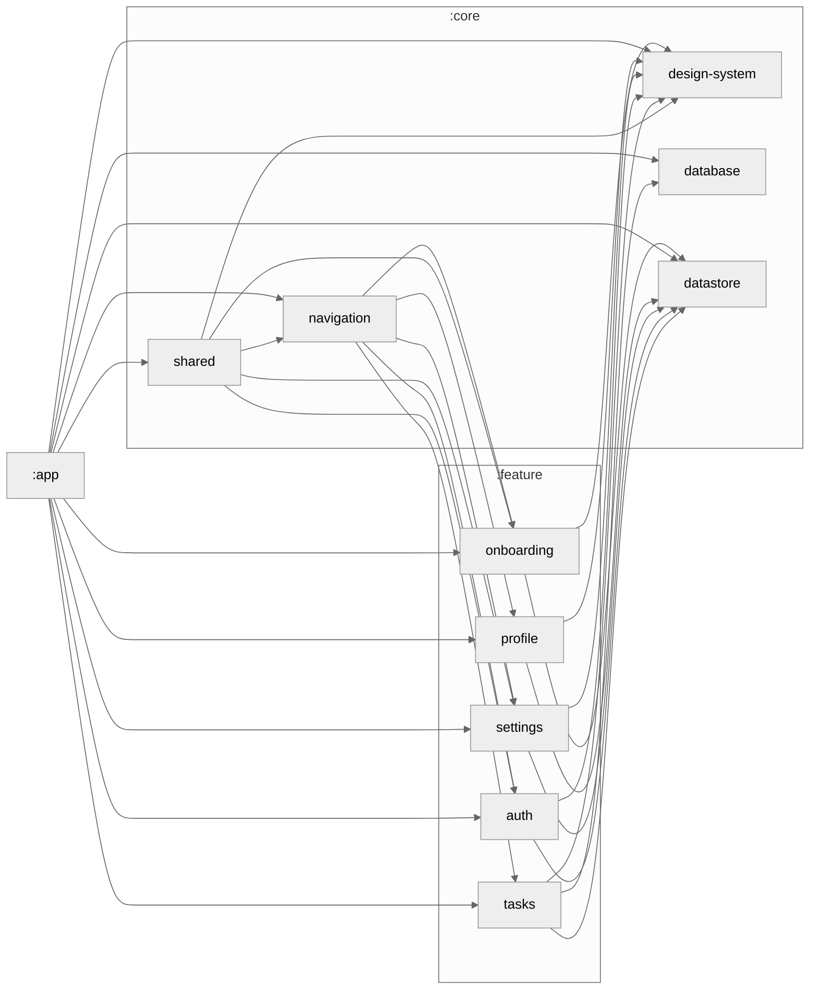

### Module Graph

```mermaid
%%{
  init: {
    'theme': 'neutral'
  }
}%%

graph LR
  subgraph :core
    :core:shared["shared"]
    :core:design-system["design-system"]
    :core:navigation["navigation"]
    :core:database["database"]
    :core:datastore["datastore"]
  end
  subgraph :feature
    :feature:settings["settings"]
    :feature:onboarding["onboarding"]
    :feature:auth["auth"]
    :feature:tasks["tasks"]
    :feature:profile["profile"]
  end
  :core:shared --> :feature:settings
  :core:shared --> :feature:onboarding
  :core:shared --> :feature:auth
  :core:shared --> :core:design-system
  :core:shared --> :core:navigation
  :core:navigation --> :feature:settings
  :core:navigation --> :feature:onboarding
  :core:navigation --> :feature:auth
  :core:navigation --> :feature:tasks
  :core:navigation --> :feature:profile
  :feature:tasks --> :core:database
  :feature:tasks --> :core:design-system
  :feature:tasks --> :core:datastore
  :feature:auth --> :core:design-system
  :feature:auth --> :core:datastore
  :feature:settings --> :core:datastore
  :feature:settings --> :core:design-system
  :feature:profile --> :core:design-system
  :feature:profile --> :core:datastore
  :app --> :core:database
  :app --> :core:design-system
  :app --> :core:datastore
  :app --> :feature:onboarding
  :app --> :feature:settings
  :app --> :feature:tasks
  :app --> :feature:auth
  :app --> :feature:profile
  :app --> :core:shared
  :app --> :core:navigation
  :feature:onboarding --> :core:design-system
  :feature:onboarding --> :core:datastore
```