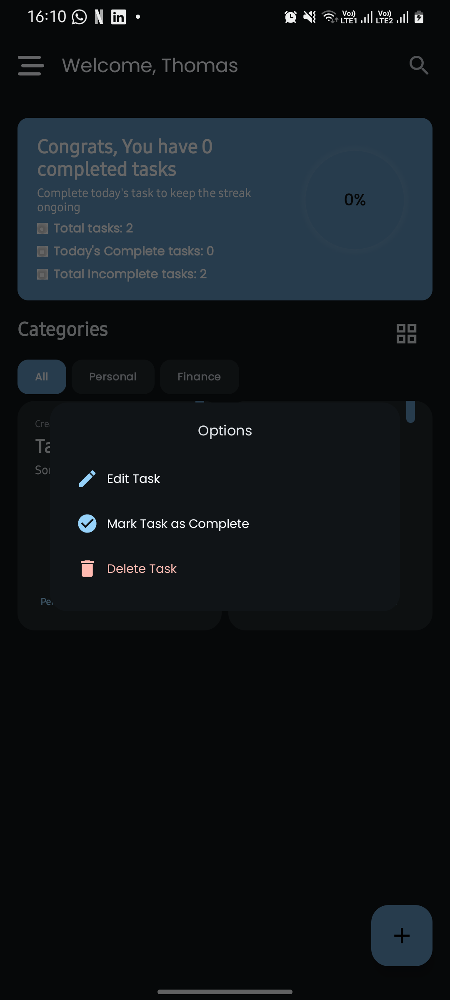

# Tasks App - Compose  🚀 
A Jetpack compose android app built using Kotlin that enables users to create, edit[on progress] and delete tasks. The app achieves this by use of Room Database for local storage and FirebaseFirestore to store tasks online. The app works both offline and online.

## Table Of Content.
- [Screenshots](#screenshots)
- [Architecture](#architecture)
    - [What is Clean Architecture](##why-clean-architecture)
    - [Why Clean Architecture](##why-clean-architecture)
    - [Layers](##layers)
        - [Domain](###domain)
        - [Data](###data)
        - [Presentation](###presentation)
- [Tech Stack](#techstack)
    - [Libraries](##libraries)
- [Helpful Resources](#helpful-resources)

  
# Screenshots
  
   
 
 

# Tech Stack.
This project uses many of the popular libraries, plugins and tools of the android ecosystem.

- [Kotlin](https://developer.android.com/kotlin) - Kotlin is a programming language that can run on JVM. Google has announced Kotlin as one of its officially supported programming languages in Android Studio; and the Android community is migrating at a pace from Java to Kotlin.
- Jetpack components:
    - [Jetpack Compose](https://developer.android.com/jetpack/compose) - Jetpack Compose is Android’s modern toolkit for building native UI. It simplifies and accelerates UI development on Android. Quickly bring your app to life with less code, powerful tools, and intuitive Kotlin APIs.
    - [Android KTX](https://developer.android.com/kotlin/ktx.html) - Android KTX is a set of Kotlin extensions that are included with Android Jetpack and other Android libraries. KTX extensions provide concise, idiomatic Kotlin to Jetpack, Android platform, and other APIs.
    - [AndroidX](https://developer.android.com/jetpack/androidx) - Major improvement to the original Android [Support Library](https://developer.android.com/topic/libraries/support-library/index), which is no longer maintained.
    - [Lifecycle](https://developer.android.com/topic/libraries/architecture/lifecycle) - Lifecycle-aware components perform actions in response to a change in the lifecycle status of another component, such as activities and fragments. These components help you produce better-organized, and often lighter-weight code, that is easier to maintain.
    - [ViewModel](https://developer.android.com/topic/libraries/architecture/viewmodel) -The ViewModel class is designed to store and manage UI-related data in a lifecycle conscious way.
    - [Room database](https://developer.android.com/training/data-storage/room) - The Room persistence library provides an abstraction layer over SQLite to allow fluent database access while harnessing the full power of SQLite.
    - [StateFlows](https://developer.android.com/kotlin/flow/stateflow-and-sharedflow) - StateFlow is a state-holder observable flow that emits the current and new state updates to its collectors. The current state value can also be read through its value property.
  
- [Kotlin Coroutines](https://developer.android.com/kotlin/coroutines) - A concurrency design pattern that you can use on Android to simplify code that executes asynchronously.
- [Kotlin Flow](https://developer.android.com/kotlin/flow) - In coroutines, a flow is a type that can emit multiple values sequentially, as opposed to suspend functions that return only a single value.
- [Dagger Hilt](https://developer.android.com/training/dependency-injection/hilt-android) - A dependency injection library for Android that reduces the boilerplate of doing manual dependency injection in your project.
- [Logging Interceptor](https://github.com/square/okhttp/blob/master/okhttp-logging-interceptor/README.md) -  logs HTTP request and response data.
- [Coil](https://coil-kt.github.io/coil/compose/)- An image loading library for Android backed by Kotlin Coroutines.
- [Timber](https://github.com/JakeWharton/timber)- A logger with a small, extensible API which provides utility on top of Android's normal Log class.
- [Firebase-Auth](https://firebase.google.com/docs/auth)- Firebase Authentication provides backend services, easy-to-use SDKs, and ready-made UI libraries to authenticate users to your app.
- [FirebaseFirestore](https://firebase.google.com/docs/firestore)- Cloud Firestore is a flexible, scalable database for mobile, web, and server development from Firebase and Google Cloud. Like Firebase Realtime Database, it keeps your data in sync across client apps through realtime listeners and offers offline support for mobile and web so you can build responsive apps that work regardless of network latency or Internet connectivity. 

# Helpful Resources
In this section i've included some resources ie. articles and GitHub reposirtories that are helpful when learning about clean architecture:

1. [The clean code blog](https://blog.cleancoder.com/uncle-bob/2012/08/13/the-clean-architecture.html) by Robert C. Martin.
2. [A detailed guide on developing android apps using clean architecture pattern](https://medium.com/@dmilicic/a-detailed-guide-on-developing-android-apps-using-the-clean-architecture-pattern-d38d71e94029) Medium article.
3. [Clean Architecture Component Boilerplater](https://github.com/bufferapp/clean-architecture-components-boilerplate) GitHub repo .

  ## Support
  
- Found this project useful ❤️? Support by clicking the ⭐️ button on the upper right of this page. ✌
- Feel free to contribute in any way to the project from typos in docs to code review are all welcome.
